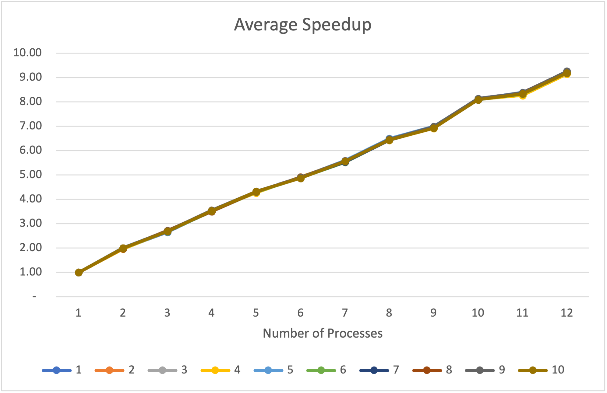
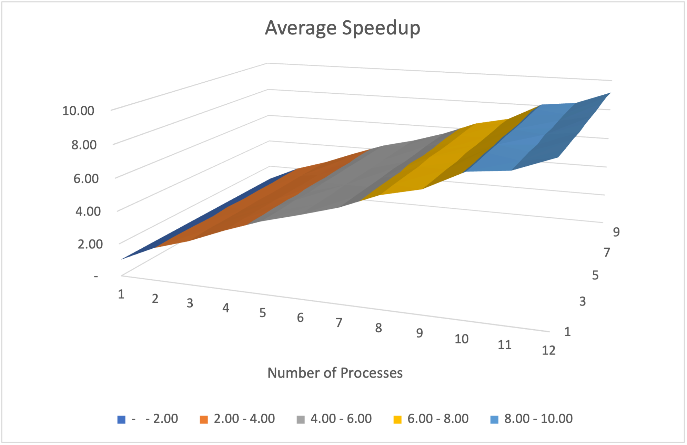
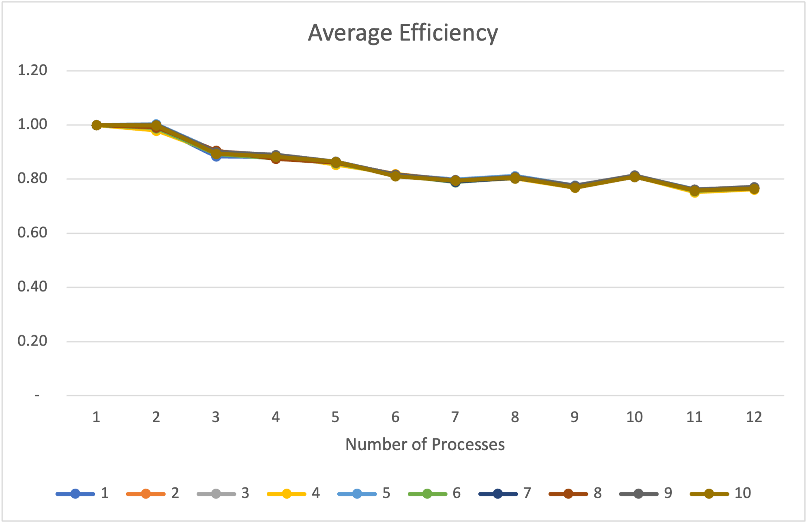
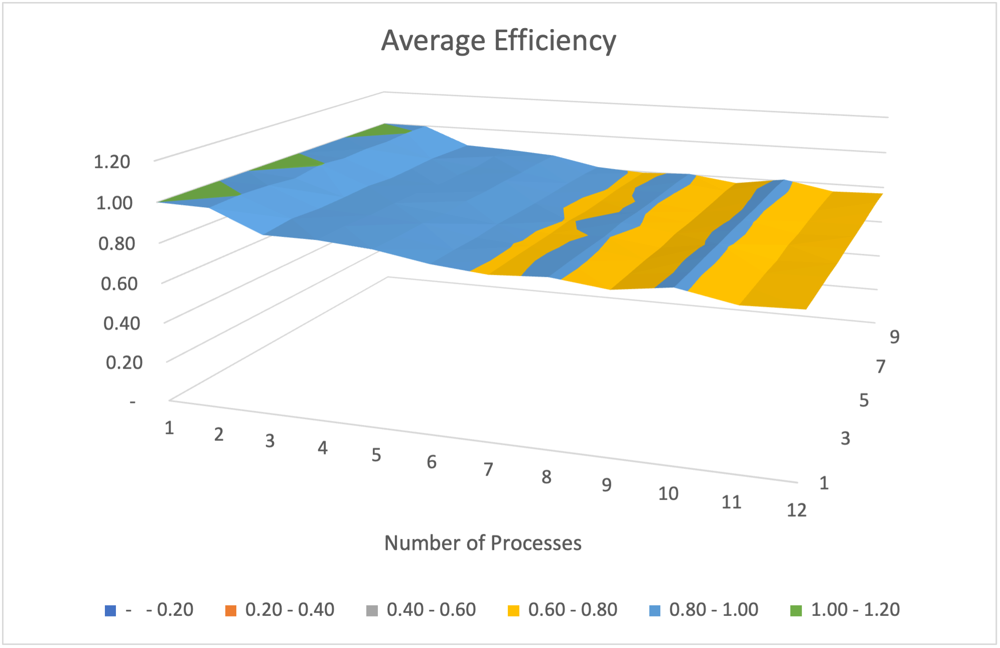
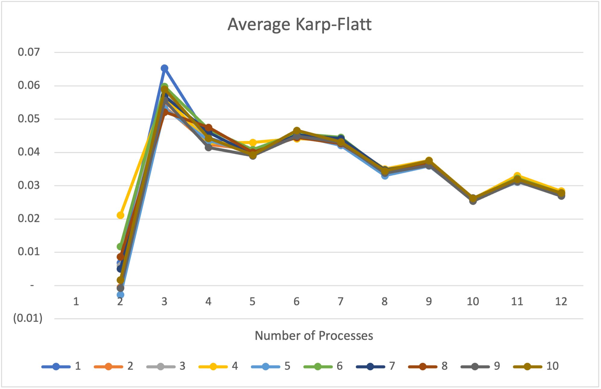
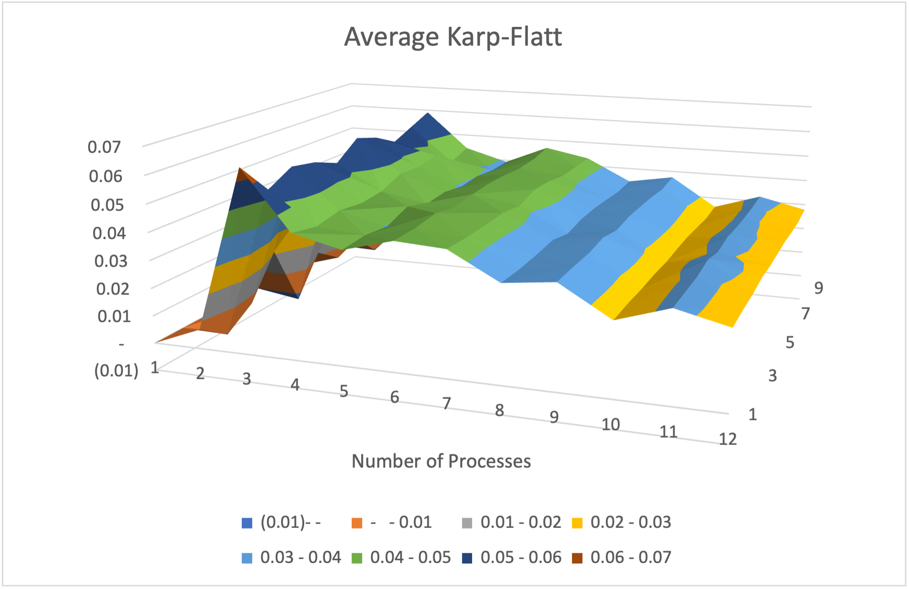

### MPI Assignment #2, CS 4170/5170, Name: Parker Henry ###


## Summary ##
My work for our Assignment #2 parallelizes the particle swarm optimization algorithm through using the OpenMPI library. This library helps us parallelize our programs by adding and configuring how processes communicate with each other, rather than how threads communicate with each other to execute a program in parallel. After determining a solution regarding the code, I ran 1-12 processes, each with 10 trails to obtain valid data for all runs of the program. This data helped me then plot the performance-tracking metrics that are described later in this README file. 

## Algorithm Overview ##
The particle swarm optimization algorithm at a high-level is an iterative algorithm that looks for one candidate solution point on a plane for all other points to "flock" to. This algorithm imitates the process of bird flocking or fish schooling in terms of a real-life scenario. 
Regarding the algorithm itself, there first needs to be a population that is defined/created. The particle swarm optimization do this through iterating through each "particle" or entity in the population to get the Rastrigin fitness regarding its particle number and the number of dimensions that are being analyzed. The Rastrigin function is defined as

$$ fitness = \sum_{i=1}^{n} \left(\text{pow}(X_i, 2) - 10 \cdot \cos(2 \cdot \pi \cdot X_i) + 10\right)

## Parallelization Methodology ##

## Performance-Tracking Functions that we tracked with our Results ##
- **Speedup** is the ratio defined as $$ S_p=T_serial/T_parallel $$ The results of the speedup graph encapsulating the performance of each trial of each thread increase at a high rate as more proccesses were added. This goes to show how the PSO algorithm is "Embarrasingly" parallel. This speedup graph for MPI processes was overall more consistent compared to using OpenMP threads for gaining a speedup. A serial time of around 16 seconds was able to be decreased into about 1.7 seconds. This gave us a very impressive speedup of around 9.00 which is just around the same speedup gained by parallelizing through OpenMP. This suggests that there is no major performance gain by using one or the other for the particle swarm optimization algorithm.
- **Efficiency** is defined as $$E_p = S_p/p $$ The efficiency values in the graph are slightly decreasing per-trial and then eventually leveled-out as more processes were added when executing particle swarm optimization. The decrease in efficiency isn't drastic, which means that most of the allocated cores and power are being used. However, since it is still decreasing as more threads are added, there is room for the problem size to be increased to have full utilization of the allocated number of cores and "power". The leveling-off of the efficiency also suggests that adding more processes doesn't necessarily decrease the efficiency, but better distributes the problem size accross all number of processes.
- **Karp-Flatt** is defined as $$ e = \frac{1/s - 1/p}{1-1/p} $$ The results for the Karp-Flatt graph increased rapidly from 2 to 3 processes, then started to decrease and slightly oscillate through increasing and decreasing values as more processes were added. The lower the value of "e" tends to mean the code is parallelized in the best and most efficient way. Having this metric mainly decrease shows that there is still room for improvement in-terms of how the code is parallelized. However, there were some cases that ended up performing well in-terms of the Karp-Flatt metric such as running PSO with 2, 10, and 12 processes which generated the best Karp-Flatt values.

## Results ##
All results are available in [CSV](./Results/results.csv) and [Excel](./Results/results.xlsx) format. 

<div style="align:center;">









</div>

## Running ##
To compile and run from command line if you are not on windows:
```
cd src
mpicxx main.cpp CStopWatch.cpp
mpiexec --allow-run-as-root --oversubscribe -n X MPI
```
or
```
cd Default && make all
mpiexec --allow-run-as-root --oversubscribe -n X MPI
```
where `X` is the number of nodes

## Running on OSC ##
To run on OSC we can use the slurm script provided by running the command:
```
sbatch jobScript.slurm
```